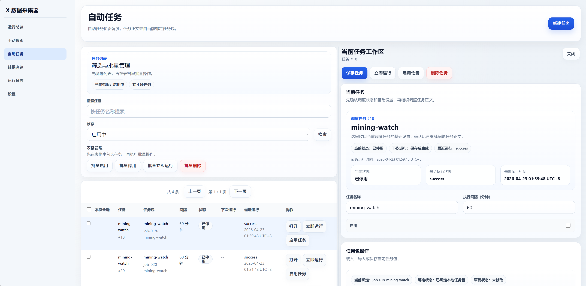

# X数据采集器

[](https://github.com/gis2all/xdata-collector/actions/workflows/ci.yml)
[](LICENSE)

本项目是一个本地运行的 X 数据采集、规则筛选、结果沉淀工作台，负责 X 搜索、本地 API、任务调度、SQLite 存储和 Web UI。




## 核心能力

- 手动执行任务：编辑任务草稿并立即运行
- 自动任务：按 jobs registry 调度任务包
- 结果浏览：浏览 `x_items_raw` / `x_items_curated`，支持删除、去重
- 运行总览与日志：查看服务状态、运行记录和当前日志

## 快速开始

> 不要使用自己的X账号，经检验一定会被限制！使用测试账号虽然会被限制，但是还可以正常获取数据。

### 获取X Cookie
在已登录 `https://x.com` 的浏览器开发者工具里，从 `Application -> Storage -> Cookies -> https://x.com` 取出 `auth_token` 和 `ct0`，再写入项目根目录 `.env`：

```env
TWITTER_AUTH_TOKEN=你的 auth_token
TWITTER_CT0=你的 ct0
```

### 依赖与启动
```bash
python install.py #安装项目依赖
python services.py start #一键启动所有服务
```

默认访问：`http://127.0.0.1:5177`

### Docker 启动

如果希望用 Docker 隔离本地运行环境，先确保 `.env` 已写入 `TWITTER_AUTH_TOKEN` / `TWITTER_CT0`，并停止本机端口上的旧服务：

```bash
python services.py stop
docker compose up --build
```

默认访问：`http://127.0.0.1:5177`。API 暴露在 `http://127.0.0.1:8765`。

Docker Compose 会启动三个服务：

- `api`：本地 HTTP API
- `scheduler`：固定 tick 调度器
- `web-ui`：Vite 开发态 Web UI

容器内的 API 和 scheduler 默认通过 Windows 宿主机上的 Clash Verge 混合代理端口访问外网：

```text
http://host.docker.internal:7897
```

如果 Clash Verge 的端口不是 `7897`，可以在启动前覆盖：

```bash
DOCKER_PROXY_URL=http://host.docker.internal:7890 docker compose up --build
```

如果容器无法连接代理，先确认 Clash Verge 已开启并允许来自 Docker 的连接；Docker Desktop 下容器访问宿主机要使用 `host.docker.internal`，不要写 `127.0.0.1`。

以下目录会挂载到容器中并保留在宿主机：

- `config/`
- `data/`
- `runtime/`
- `.env`

停止 Docker 服务：

```bash
docker compose down
```

## 运行入口与端口

- `python install.py`：推荐首次安装入口，会调用 `run/bootstrap.py` 并安装前端依赖
- `python services.py start`：启动 API、Scheduler 和开发态 Web UI
- `python run/bootstrap.py`：底层依赖准备脚本，通常由 `install.py` 调用
- 常用命令：`python services.py status`、`python services.py stop`、`python services.py restart`
- 端口：API `127.0.0.1:8765`，开发态 Web UI `127.0.0.1:5177`，静态预览 `127.0.0.1:5178`

如果只想看构建后的静态页面，先运行 `cd web-ui && npm run build`，再运行 `python run/static_web_server.py --root web-ui/dist`。Scheduler 没有独立 HTTP 端口。

## 关键边界

- `config/`：`workspace.json` 和 `packs/*.json`
- `runtime/`：运行记录、健康快照、日志、PID、临时文件
- `data/app.db`：本地 SQLite 结果库，项目默认直接连接，首次启动会自动创建，当前只保存 `x_items_raw` 和 `x_items_curated`

## 最小排障顺序

1. 检查 `.env` 里是否有 `TWITTER_AUTH_TOKEN` / `TWITTER_CT0`
2. 检查 `python services.py status`
3. 检查 `http://127.0.0.1:8765/health`
4. 最后再看前端页面或任务配置
