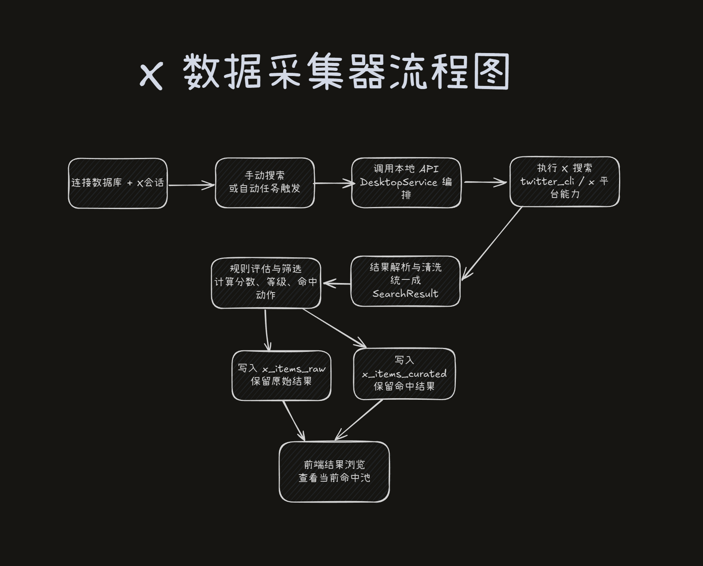

# X数据采集器

本项目是一个本地运行的 X 数据采集、规则筛选、结果沉淀工作台，负责 X 搜索、本地 API、任务调度、SQLite 存储和 Web UI。



## 核心能力

- 手动执行任务：编辑任务草稿并立即运行
- 自动任务：按 jobs registry 调度任务包
- 结果浏览：浏览 `x_items_raw` / `x_items_curated`，支持删除、去重
- 运行总览与日志：查看服务状态、运行记录和当前日志

## 快速开始

> 不要使用自己的X账号，经测试一定会被限制！使用测试账号虽然会被限制，但是还可以正常获取数据。

先运行 `python run/bootstrap.py` 准备本机依赖。运行采集前，在已登录 `https://x.com` 的浏览器开发者工具里，从 `Application -> Storage -> Cookies -> https://x.com` 取出 `auth_token` 和 `ct0`，再写入项目根目录 `.env`：

```env
TWITTER_AUTH_TOKEN=你的 auth_token
TWITTER_CT0=你的 ct0
TWITTER_BROWSER=edge
TWITTER_CHROME_PROFILE=Default
```

其中 `TWITTER_AUTH_TOKEN` 和 `TWITTER_CT0` 必填；`TWITTER_BROWSER`、`TWITTER_CHROME_PROFILE` 只是可选提示，不能替代 cookie。

```bash
python run/services.py start
cd web-ui
npm install
cd ..
python run/services.py start
```

默认访问：`http://127.0.0.1:5177`

## 运行入口与端口

- `python run/bootstrap.py`：准备 `twitter-cli`、`agent-browser` 等依赖，不启动服务
- `python run/services.py start`：启动 API、Scheduler 和开发态 Web UI
- 常用命令：`python run/services.py status`、`python run/services.py stop`、`python run/services.py restart`
- 端口：API `127.0.0.1:8765`，开发态 Web UI `127.0.0.1:5177`，静态预览 `127.0.0.1:5178`

如果只想看构建后的静态页面，先运行 `cd web-ui && npm run build`，再运行 `python run/static_web_server.py --root web-ui/dist`。Scheduler 没有独立 HTTP 端口。

## 关键边界

- `config/`：`workspace.json` 和 `packs/*.json`
- `runtime/`：运行记录、健康快照、日志、PID、临时文件
- `data/app.db`：结果库，当前只保存 `x_items_raw` 和 `x_items_curated`

## 最小排障顺序

1. 检查 `.env` 里是否有 `TWITTER_AUTH_TOKEN` / `TWITTER_CT0`
2. 检查 `python run/services.py status`
3. 检查 `http://127.0.0.1:8765/health`
4. 最后再看前端页面或任务配置
