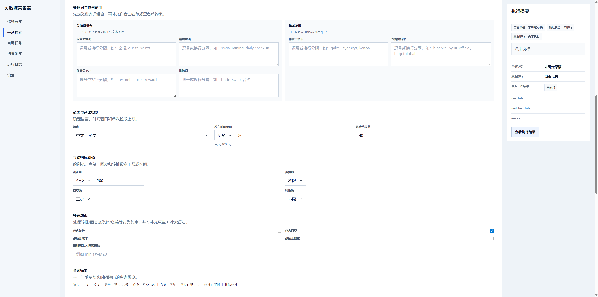

# X数据采集器

[](https://github.com/gis2all/xdata-collector/actions/workflows/ci.yml)
[](https://github.com/gis2all/xdata-collector/actions/workflows/ci.yml)
[](LICENSE)

这是一个本地运行的 `X` 数据采集与规则筛选工作台，用于定义任务、采集 `X` 数据、按规则筛选结果，并将数据沉淀到本地 `SQLite`，再通过 `Web UI` 进行浏览、复盘与调度。



## 产品概览

该项目覆盖一条完整的本地工作流程：

1. 定义任务：维护关键词、时间范围、过滤条件、规则和标签
2. 采集数据：手动运行，或者按自动任务定时执行
3. 筛选结果：把原始搜索结果和规则命中结果分别沉淀下来
4. 浏览复盘：在工作台里查看结果、运行状态和日志

典型使用场景包括：

- 想持续跟踪某一类 `X` 信息流
- 想把搜索和筛选逻辑固化成可重复执行的任务
- 想在本地保留一份可查询、可复盘的结果库

该仓库定位为**本地工作台**，不负责下游投递平台或远端服务化部署。

## 快速开始

> 不要使用个人 `X` 主账号。现有使用经验表明一定会触发限制，专门的测试账号虽然限制但仍可获取数据。

### 1. 准备 X Cookie

在已登录 `https://x.com` 的浏览器开发者工具里，从 `Application -> Storage -> Cookies -> https://x.com` 取出 `auth_token` 和 `ct0`，再写入项目根目录 `.env` 文件：

```env
TWITTER_AUTH_TOKEN=你的 auth_token
TWITTER_CT0=你的 ct0
```

Cookie 过期、账号风控或浏览器 Cookie 解密失败都会影响采集稳定性。

### 2. 选择启动方式

#### 本机启动

适用于希望直接在当前机器上运行服务、查看本地日志并进行调试的场景。

准备条件：

- 已安装 `Python`
- 已安装 `Node.js / npm`

执行：

```powershell
python install.py
python services.py start
```

`python install.py` 会先调用 `run/bootstrap.py` 准备本机依赖，包括安装/更新 `pipx`、通过 `pipx` 安装 `twitter-cli`，以及通过 `npm` 安装 `xreach-cli`。如果安装过程提示 PATH 已变更，请重新打开终端后再运行 `python services.py start`。

该路径会启动以下三个服务：

- `API`
- `Scheduler`
- `Dev UI`

默认访问：

- 工作台：`http://127.0.0.1:5177`
- 健康检查：`http://127.0.0.1:8765/health`

#### Docker 启动

适用于希望将运行环境隔离到容器中的场景。执行前请先确认 `.env` 已写入 `TWITTER_AUTH_TOKEN` / `TWITTER_CT0`。

```powershell
docker compose up --build
```

该路径同样会启动以下三个服务：

- `api`
- `scheduler`
- `web-ui`

默认访问：

- 工作台：`http://127.0.0.1:5177`
- API：`http://127.0.0.1:8765`

当前 `Docker Compose` 默认挂载以下目录：

- `config/`
- `data/`
- `runtime/`
- `.env`

停止容器：

```powershell
docker compose down
```

Docker 注意事项：

- 默认代理是 `http://host.docker.internal:7897`；
- 不用代理时请移除 `docker-compose.yml` 里的代理环境变量，使用其他代理时设置 `DOCKER_PROXY_URL`

## 常用入口

常用命令：

- `python install.py`：准备 `pipx` / `twitter-cli` / `xreach-cli` 并安装前端依赖
- `python services.py start`：启动 `API`、`Scheduler` 和 `Dev UI`
- `python services.py stop`：停止服务
- `python services.py restart`：重启服务
- `python services.py status`：查看服务状态

默认端口：

- API：`127.0.0.1:8765`
- 开发态 Web UI：`127.0.0.1:5177`
- 静态预览：`127.0.0.1:5178`

如需要预览前端构建产物，可执行：

```powershell
cd web-ui
npm.cmd run build
cd ..
python run/static_web_server.py --root web-ui/dist
```

## 更多文档

- [`CLAUDE.md`](CLAUDE.md)：项目真相、架构、搜索链路、页面行为、维护手册
- [`config/README.md`](config/README.md)：`workspace.json`、task pack 和配置边界
